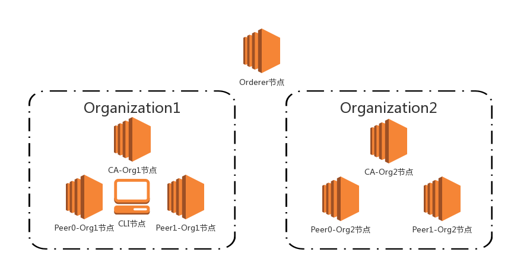

# Fugitive Consortium

## Introduction

基于`fabric-java-sdk`实现的区块链追逃记录账本. 项目分为网络, 应用和链码三部分: 

* 网络: 生成容器网络启动所需的文件(见`build-network`文件夹), 除开编写和设置容器网络配置信息外, 将启动/关闭网络的命令写好shell脚本方便调用. 并预生成了可用的网络配置文件(见`network-resources`文件夹)
* 应用: 根据`fabric-java-sdk`给出的几个类, 封装成更便于使用的manager类, 并将其用于完成创建通道, 注册用户, 部署链码, 调用链码等操作. 
* 链码: 创建了一个Person类存储逃犯人员信息, 重载`ChaincodeBase`类的`init`和`invoke`方法, 在`init`方法内完成账本的初始化操作, 在`invoke`方法内根据应用请求(增删查改)进入到不同的处理方法中, 读取更改账本上的信息.


网络拓扑结构如下所示: 



```
.
├── build-network
│   ├── common-services.yml             # 对peer节点, orderer节点和ca节点的通用配置, 用于docker-compose.yml
│   ├── configtx.yaml                   # 包含对所创建的容器网络的定义
│   ├── crypto-config.yaml              # 包含加密文件(证书等)的生成配置
│   ├── docker-compose.yml              # docker-compose的配置文件, 根据该配置文件信息生成容器网络
│   ├── generate.sh                     # 用于证书文件, orderer节点创世区块, 通道配置以及背书节点配置
│   ├── init.sh                         # 用于初始化docker容器网络构建环境
│   ├── restart.sh                      # teardown.sh 和 start.sh 的整合. 用于开发时重置容器网络
│   ├── start.sh                        # 命令docker-compose启动容器网络
│   ├── stop.sh                         # 命令docker-compose停止容器网络
│   └── teardown.sh                     # 命令docker-compose停止容器网络, 并清除所有docker容器和链码对应的docker镜像
├── docs
│   ├── Instructions.md                 # 描述手动部署分布式账本网络所需要的一些命令
│   └── VSCodeSetup.md                  # 描述在VS Code中进行构建应用, 调试代码, 单元测试的步骤与命令
├── fugitivec
│   ├── pom.xml                         # maven工程配置文件
│   ├── src                             # 应用源代码所在目录
│   │   ├── com
│   │   │   └── vancir
│   │   │       ├── integration
│   │   │       │   ├── CreateChannel.java              # 用于创建通道并进行配置
│   │   │       │   ├── DeployChaincode.java            # 用于部署链码到网络
│   │   │       │   ├── InvokeChaincode.java            # 用于调用链码, 获取链码返回响应
│   │   │       │   └── RegisterAndEnrollUser.java      # 用于注册应用用户
│   │   │       ├── manager
│   │   │       │   ├── CAManager.java                  # 用于管理HFCAClient类的使用
│   │   │       │   ├── ChannelManager.java             # 用于管理Channel类的使用
│   │   │       │   └── FabricManager.java              # 用于管理HFClient类的使用
│   │   │       ├── network
│   │   │       │   └── CAEnrollment.java               # 实现Enrollment类接口方法
│   │   │       ├── user
│   │   │       │   └── AppUser.java                    # 用户类, 定义了应用用户的相关信息
│   │   │       └── utilities
│   │   │           ├── Config.java                     # 配置信息类, 定义了项目需要的一些配置信息
│   │   │           └── Util.java                       # 实用工具类, 定义了一些辅助性的方法
│   │   ├── resources
│   │   │   └── log4j.properties                        # 日志工具log4j的配置文件
│   │   └── test                                        # 单元测试所在目录
│   │       └── java
│   │           └── TestOrgAdmin.java                   # 对orgAdmin相关操作的单元测试
├── LICENSE
├── network-resources
│   ├── chaincode
│   │   ├── pom.xml                     # maven工程配置文件
│   │   ├── src                         # 链码源代码所在目录
│   │   │   ├── fugitivec
│   │   │   │   └── Chaincode.java      # 链码源代码
│   │   │   └── resources               # 资源文件目录
│   │   │       └── log4j.properties    # 日志工具log4j的配置文件
│   ├── channel-artifacts               # 包含运行generate.sh后生成的创世区块, 通道配置, 背书节点配置.
│   └── crypto-config                   # 包含运行generate.sh后生成的证书文件信息
└── README.md
```


## Prerequisites

1. [Java 8u181](): 建议使用这个版本的JDK用作开发. 
2. [Hyperledger Fabric Java SDK 1.3.0](https://github.com/hyperledger/fabric-sdk-java): 使用Fabric给出的java sdk编写链码以及应用. 
3. [Apache Maven](https://maven.apache.org): 使用Maven管理Java工程项目, 生成应用.
4. [Docker 18.09.0](https://www.docker.com/): 使用Docker部署容器, 用于构建网络拓扑结构.
5. [Docker Compose 1.22.0](https://docs.docker.com/compose/): 使用配置文件来定义和运行管理容器的Docker工具, 配置可见`build-network/docker-compose.yml`

如何配置Fabric环境可参见: [Hyperledger Fabric Docs - Prerequisites](https://hyperledger-fabric.readthedocs.io/en/release-1.3/prereqs.html) 和 [Install Samples, Binaries and Docker Images](https://hyperledger-fabric.readthedocs.io/en/release-1.3/install.html). 

## Quick Start

1. 生成容器网络运行所需的文件并启动网络

> 注意: 运行`generate.sh`重新生成证书等信息后, 需要重新修改`docker-compose.yml`中`ca.org1.vancir.com`和`ca.org2.vancir.com`的环境变量`FABRIC_CA_SERVER_CA_KEYFILE`及`FABRIC_CA_SERVER_CA_CERTFILE`为相应的证书及密钥路径. 对应的路径在`network-resources/crypto-config/peerOrganizations/org1(2).vancir.com/ca`. 当然默认我已经预生成好的证书等信息并配置好, 无需再次运行`generate.sh`

``` bash
$ cd build-network
$ chmod +x *.sh
$ ./init.sh
$ ./generate
$ ./start.sh
```

你也可用使用`stop.sh`停止网络, `teardown.sh`停止并清除网络. 


2. 生成应用

``` bash
$ cd fugitivec
$ ls
pom.xml  src
$ mvn install
```
确保你安装好了maven并将其添加到了你的环境变量中去. `mvn install`将会下载项目的依赖包并进行测试构建并生成应用, 输出到`target`文件夹内. 

``` bash
$ ls
archive-tmp  fugitivec-1.0-SNAPSHOT.jar                        generated-sources  maven-status
classes      fugitivec-1.0-SNAPSHOT-jar-with-dependencies.jar  maven-archiver
```

3. 生成链码

``` bash
$ cd network-resources/chaincode
$ ls
pom.xml  src 
$ mvn install
```

同上生成应用步骤, 该步骤将会生成链码对应的jar包, 放置于`target`文件夹内.

5. 运行应用

* 将应用对应的jar包放置在`network-resources`目录下. 

``` bash
$ cd network-resources
$ cp ../fugitivec/target/fugitivec-1.0-SNAPSHOT-jar-with-dependencies.jar .
```

因为运行时的一些路径原因, 需要将生成的`fugitivec-1.0-SNAPSHOT-jar-with-dependencies.jar`放置在`network-resources`文件夹下.

* 创建通道

将jar包放置于`network-resources`文件夹下后, 可以使用`java -cp`命令指定jar后运行`CreateChannel`类. 

``` bash
$ java -cp fugitivec-1.0-SNAPSHOT-jar-with-dependencies.jar com.vancir.integration.CreateChannel
2018-12-20 13:58:00 WARN  Config:127 - Failed to load any configuration from: config.properties. Using toolkit defaults
2018-12-20 13:58:01 INFO  Channel:770 - Channel{id: 3, name: mychannel} joining Peer{ id: 5, name: peer0.org1.vancir.com, channelName: null, url: grpc://localhost:7051}.
2018-12-20 13:58:02 INFO  Channel:802 - Peer Peer{ id: 5, name: peer0.org1.vancir.com, channelName: mychannel, url: grpc://localhost:7051} joined into channel Channel{id: 3, name: mychannel}
2018-12-20 13:58:02 INFO  Channel:770 - Channel{id: 3, name: mychannel} joining Peer{ id: 6, name: peer1.org1.vancir.com, channelName: null, url: grpc://localhost:7056}.
2018-12-20 13:58:02 INFO  Channel:802 - Peer Peer{ id: 6, name: peer1.org1.vancir.com, channelName: mychannel, url: grpc://localhost:7056} joined into channel Channel{id: 3, name: mychannel}
2018-12-20 13:58:02 INFO  Channel:1147 - Channel Channel{id: 3, name: mychannel} eventThread started shutdown: false  thread: null 
2018-12-20 13:58:02 INFO  Channel:770 - Channel{id: 3, name: mychannel} joining Peer{ id: 7, name: peer0.org2.vancir.com, channelName: null, url: grpc://localhost:8051}.
2018-12-20 13:58:02 WARN  PeerEventServiceClient:230 - PeerEventServiceClient{id: 16, channel: mychannel, peerName: peer0.org2.vancir.com, url: grpc://localhost:8051} PeerEventServiceClient{id: 16, channel: mychannel, peerName: peer0.org2.vancir.com, url: grpc://localhost:8051} attempts 0 Status returned failure code 404 (NOT_FOUND) during peer service event registration
2018-12-20 13:58:03 INFO  Channel:802 - Peer Peer{ id: 7, name: peer0.org2.vancir.com, channelName: mychannel, url: grpc://localhost:8051} joined into channel Channel{id: 3, name: mychannel}
2018-12-20 13:58:03 INFO  Channel:770 - Channel{id: 3, name: mychannel} joining Peer{ id: 8, name: peer1.org2.vancir.com, channelName: null, url: grpc://localhost:8056}.
2018-12-20 13:58:03 WARN  PeerEventServiceClient:230 - PeerEventServiceClient{id: 19, channel: mychannel, peerName: peer1.org2.vancir.com, url: grpc://localhost:8056} PeerEventServiceClient{id: 19, channel: mychannel, peerName: peer1.org2.vancir.com, url: grpc://localhost:8056} attempts 0 Status returned failure code 404 (NOT_FOUND) during peer service event registration
2018-12-20 13:58:03 INFO  Channel:802 - Peer Peer{ id: 8, name: peer1.org2.vancir.com, channelName: mychannel, url: grpc://localhost:8056} joined into channel Channel{id: 3, name: mychannel}
2018-12-20 13:58:03 INFO  CreateChannel:65 - peer1.org2.vancir.com at grpc://localhost:8056
2018-12-20 13:58:03 INFO  CreateChannel:65 - peer0.org2.vancir.com at grpc://localhost:8051
2018-12-20 13:58:03 INFO  CreateChannel:65 - peer0.org1.vancir.com at grpc://localhost:7051
2018-12-20 13:58:03 INFO  CreateChannel:65 - peer1.org1.vancir.com at grpc://localhost:7056

```

* 部署链码

使用`DeployChaincode`来部署并实例化链码. 因为在`DeployChaincode`内有做创建通道的操作, 因此在运行`DeployChaincode`之前, 你应当运行`build-network/restart.sh`重置容器网络. 

``` bash
$ cd ../build-network
$ ./restart.sh
$ cd ../network-resources
$ java -cp fugitivec-1.0-SNAPSHOT-jar-with-dependencies.jar com.vancir.network.DeployChaincode
2018-12-20 14:21:04 WARN  Config:127 - Failed to load any configuration from: config.properties. Using toolkit defaults
2018-12-20 14:21:05 INFO  Channel:770 - Channel{id: 3, name: mychannel} joining Peer{ id: 5, name: peer0.org1.vancir.com, channelName: null, url: grpc://localhost:7051}.
2018-12-20 14:21:06 INFO  Channel:802 - Peer Peer{ id: 5, name: peer0.org1.vancir.com, channelName: mychannel, url: grpc://localhost:7051} joined into channel Channel{id: 3, name: mychannel}
2018-12-20 14:21:06 INFO  Channel:770 - Channel{id: 3, name: mychannel} joining Peer{ id: 6, name: peer1.org1.vancir.com, channelName: null, url: grpc://localhost:7056}.
2018-12-20 14:21:06 INFO  Channel:802 - Peer Peer{ id: 6, name: peer1.org1.vancir.com, channelName: mychannel, url: grpc://localhost:7056} joined into channel Channel{id: 3, name: mychannel}
2018-12-20 14:21:06 INFO  Channel:1147 - Channel Channel{id: 3, name: mychannel} eventThread started shutdown: false  thread: null 
2018-12-20 14:21:06 INFO  Channel:770 - Channel{id: 3, name: mychannel} joining Peer{ id: 7, name: peer0.org2.vancir.com, channelName: null, url: grpc://localhost:8051}.
2018-12-20 14:21:06 WARN  PeerEventServiceClient:230 - PeerEventServiceClient{id: 16, channel: mychannel, peerName: peer0.org2.vancir.com, url: grpc://localhost:8051} PeerEventServiceClient{id: 16, channel: mychannel, peerName: peer0.org2.vancir.com, url: grpc://localhost:8051} attempts 0 Status returned failure code 404 (NOT_FOUND) during peer service event registration
2018-12-20 14:21:07 INFO  Channel:802 - Peer Peer{ id: 7, name: peer0.org2.vancir.com, channelName: mychannel, url: grpc://localhost:8051} joined into channel Channel{id: 3, name: mychannel}
2018-12-20 14:21:07 INFO  Channel:770 - Channel{id: 3, name: mychannel} joining Peer{ id: 8, name: peer1.org2.vancir.com, channelName: null, url: grpc://localhost:8056}.
2018-12-20 14:21:07 WARN  PeerEventServiceClient:230 - PeerEventServiceClient{id: 19, channel: mychannel, peerName: peer1.org2.vancir.com, url: grpc://localhost:8056} PeerEventServiceClient{id: 19, channel: mychannel, peerName: peer1.org2.vancir.com, url: grpc://localhost:8056} attempts 0 Status returned failure code 404 (NOT_FOUND) during peer service event registration
2018-12-20 14:21:07 INFO  Channel:802 - Peer Peer{ id: 8, name: peer1.org2.vancir.com, channelName: mychannel, url: grpc://localhost:8056} joined into channel Channel{id: 3, name: mychannel}
2018-12-20 14:21:07 INFO  InstallProposalBuilder:244 - Installing 'mycc::::1' language Java chaincode from directory: '/home/vancir/Documents/code/fugitivec/network-resources/chaincode' with source location: 'src'. chaincodePath:''
2018-12-20 14:21:09 INFO  DeployChaincode:78 - mycc - Chaincode deployment SUCCESS
2018-12-20 14:21:09 INFO  DeployChaincode:78 - mycc - Chaincode deployment SUCCESS
2018-12-20 14:21:09 INFO  InstallProposalBuilder:244 - Installing 'mycc::::1' language Java chaincode from directory: '/home/vancir/Documents/code/fugitivec/network-resources/chaincode' with source location: 'src'. chaincodePath:''
2018-12-20 14:21:11 INFO  DeployChaincode:87 - mycc - Chaincode deployment SUCCESS
2018-12-20 14:21:11 INFO  DeployChaincode:87 - mycc - Chaincode deployment SUCCESS
2018-12-20 14:24:55 INFO  ChannelManager:82 - java.util.concurrent.CompletableFuture@73302995[Not completed]
2018-12-20 14:24:55 INFO  DeployChaincode:97 - mycc - Chaincode instantiation SUCCESS
2018-12-20 14:24:55 INFO  DeployChaincode:97 - mycc - Chaincode instantiation SUCCESS
2018-12-20 14:24:55 INFO  DeployChaincode:97 - mycc - Chaincode instantiation SUCCESS
2018-12-20 14:24:55 INFO  DeployChaincode:97 - mycc - Chaincode instantiation SUCCESS
```

* 调用链码

部署并实例化链码后, 可以使用`InvokeChaincode`来调用链码

``` bash
$ java -cp fugitivec-1.0-SNAPSHOT-jar-with-dependencies.jar com.vancir.network.InvokeChaincode

```

